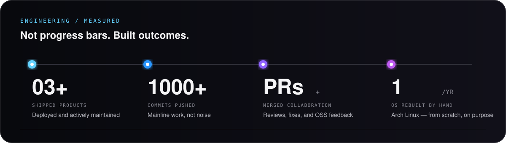

<div align="center">



<br/>

[](https://bikramgole.com.np)
[](https://github.com/BikramGole)
[](mailto:bikramgole.genius@gmail.com)

</div>

<br/>

## Minimal is a design philosophy, not a limitation.

I build small, fast, and understandable systems — from a Linux system compiled from source to AI-assisted local commerce. Every project is a chance to remove, not add.

<br/>



<br/>



<br/>

## Selected work



<table>
<tr>
<td width="33%" valign="top">

### [KinaHub](https://github.com/BikramGole/KinaHub)

AI-powered local e-commerce and CRM platform connecting sellers and customers with smart recommendations, location-aware delivery optimization, and an LLM shopping assistant via OpenRouter.

`React 19` `TypeScript` `Django REST` `PostgreSQL` `OpenRouter`

</td>
<td width="33%" valign="top">

### [Android 17](https://github.com/BikramGole/andriod17)

Cinematic interactive showcase for Android 17 "Cinnamon Bun" (API 37) — a marketing site with particle effects, a full-featured Android simulator, and a 3D Android bot built with Three.js.

`React 19` `TypeScript` `Three.js` `Redux Toolkit` `Framer Motion`

</td>
<td width="33%" valign="top">

### [BikramGole](https://github.com/BikramGole/Bikram)

My personal website — a space-themed digital realm with a dynamic theme engine, an interactive mini terminal, and a persona quiz. A true reflection of my hacker spirit.

`Vanilla JS` `CSS` `HTML` `Sitemap` `CI`

</td>
</tr>
</table>

<br/>

## Engineering, measured



> Every number is tied to shipped work — a deployed product, a merged PR, or a system built from source.

<br/>

## Toolkit

<div align="center">


</div>

<br/>

<div align="center">

[](https://github.com/BikramGole)
[](https://github.com/BikramGole?tab=followers)
[](https://github.com/BikramGole?tab=repositories)
[](https://github.com/BikramGole?tab=following)
[](https://github.com/BikramGole)
[](https://github.com/BikramGole)

</div>

<br/>

---

### 📊 GitHub Stats

<p align="left">

</p>

<div align="center">
  
  
  
  
</div>

<div align="center">
  
</div>

<br>

[](https://user-badge.committers.top/nepal/BikramGole)


<p align="center">
<a href="https://wakatime.com/@07f2f83c-a4f8-407e-ac67-6aafb674ebf8"></a>
</p>

---

### 👷 Check out what I'm currently working on

- [BikramGole/Ytdaily](https://github.com/BikramGole/Ytdaily) - High-performance, automated YouTube feed downloader with TUI, SponsorBlock, and parallel download support.
- [ashwinsunar/lustro](https://github.com/ashwinsunar/lustro) - Lustro — Premium Luxury Watches
- [BikramGole/KinaHub](https://github.com/BikramGole/KinaHub) - AI-powered local e-commerce &amp; CRM platform connecting sellers and customers with smart recommendations and delivery optimization.
- [habibishrawanshah/onesteppharmacy](https://github.com/habibishrawanshah/onesteppharmacy) - 
- [BikramGole/work-ios](https://github.com/BikramGole/work-ios) - 

### 🌱 My latest projects

- [BikramGole/work-ios](https://github.com/BikramGole/work-ios) - 
- [BikramGole/android17](https://github.com/BikramGole/android17) - I built an immersive, cinematic showcase for Android 17 &#34;Cinnamon Bun&#34; (API 37) — a premium marketing site paired with a fully functional Android simulator in the browser.
- [BikramGole/control-center](https://github.com/BikramGole/control-center) - 
- [BikramGole/JavaAssignment](https://github.com/BikramGole/JavaAssignment) - 
- [BikramGole/KinaHub](https://github.com/BikramGole/KinaHub) - AI-powered local e-commerce &amp; CRM platform connecting sellers and customers with smart recommendations and delivery optimization.

### 🔨 My recent Pull Requests

- [docs: update README with hosted site status warning](https://github.com/Rockyffgod/OJT/pull/1) on [Rockyffgod/OJT](https://github.com/Rockyffgod/OJT)
- [Swap demo/walkthrough sections in README](https://github.com/BikramGole/KinaHub/pull/72) on [BikramGole/KinaHub](https://github.com/BikramGole/KinaHub)
- [fix: use dynamic PROJECT_SLUG in sentry-event-checker](https://github.com/BikramGole/KinaHub/pull/71) on [BikramGole/KinaHub](https://github.com/BikramGole/KinaHub)
- [fix: auto-close GitHub issues when Sentry issues resolved &#43; project filter](https://github.com/BikramGole/KinaHub/pull/70) on [BikramGole/KinaHub](https://github.com/BikramGole/KinaHub)
- [fix: N&#43;1 Query [autofix]](https://github.com/BikramGole/KinaHub/pull/69) on [BikramGole/KinaHub](https://github.com/BikramGole/KinaHub)

### ⭐ Recent Stars

- [jeevannar16-web/arch-hyprland-dotfiles](https://github.com/jeevannar16-web/arch-hyprland-dotfiles) - My personal Arch Linux &#43; Hyprland dotfiles, based on end-4/dots-hyprland
- [jeevannar16-web/Python](https://github.com/jeevannar16-web/Python) - 
- [jeevannar16-web/Fitness-Hub](https://github.com/jeevannar16-web/Fitness-Hub) - &#34;Fitness-Hub - Django Fitness Platform&#34;
- [jeevannar16-web/Jeevan_Ojt](https://github.com/jeevannar16-web/Jeevan_Ojt) - 
- [jeevannar16-web/c-plus-plus](https://github.com/jeevannar16-web/c-plus-plus) - C&#43;&#43; project and assignment

---

### 💻 About Me

```bash
neo@LFS:~$ cat about_me.txt
```
I enjoy building **minimal systems** that are simple, efficient, and understandable.

Most of my work revolves around:
* **Linux customization** (making it simple & fast)
* **Small CLI utilities** (automating the mundane)
* **AI experiments** (building efficient workflows)
* **Development** (C++, Python, Bash)

---

### 🖥️ System Info

```bash
neo@LFS:~$ fastfetch --structure OS:WM:Shell:Editor:Languages:Focus
```

| Component | Detail |
| :--- | :--- |
| **OS** | LFS |
| **WM** | DWL |
| **Shell** | Bash |
| **Editor** | Neovim |
| **Focus** | AI tools, Linux customization, minimal computing |

---

### 🐍 Contribution Snake
<p align="center">


</p>

---

### 📫 Reach Me
- **Email**: [bikramgole.genius@gmail.com](mailto:bikramgole.genius@gmail.com)
- **Email**: [er@bikramgole.com.np](mailto:er@bikramgole.com.np)
- **GitHub**: [BikramGole](https://github.com/BikramGole)

---

<p align="center">
  
</p>
